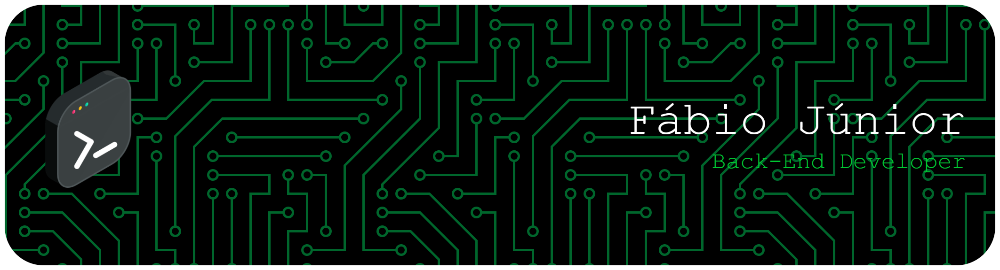

  

---

<h2 align="center">Fábio | Back-end Developer</h2>

Estudante de Ciência da Computação com formação técnica em Desenvolvimento de Sistemas. 
Focado em back-end, APIs escaláveis e boas práticas de engenharia de software.

---

## 🚀 Sobre mim

- Experiência com construção de APIs REST utilizando **FastAPI** e **Django**
- Interesse em arquitetura de software, organização de código e performance
- Prática com bancos relacionais (**PostgreSQL**) e modelagem de dados
- Familiaridade com versionamento e fluxo de desenvolvimento com Git

---

## 🧩 O que você vai encontrar aqui

- Projetos com foco em **back-end e integração de sistemas**
- Código organizado seguindo princípios de **clean code**
- Estruturas pensadas para **escala e manutenção**

---

## 🛠️ Stack Principal

  

---

## 📊 Estatísticas

  
  

---

## 🐍 Contribuições

  

---

## 🤝 Contato

  
  
  

---

  Desenvolvido por Fábio

